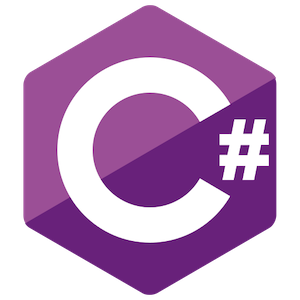

<h1>Módulo 01: Fundamentos do C#</h1>
<h2>Frameworks</h2>
<h3>Aula 16: .NET 5.</h3>

## 1. Definições:

- durante a gravação das aulas, a versão atual do .NET Core era a 3.1, com lançamento da versão 5 programada para Novembro de 2020.
- o .NET 5 é a junção de ambos frameworks, visto que o .NET Core já avançou a ponto de conter quase tudo que o .NET Framework possuía, o que também originou a versão deste novo framework, nomeada como 5, pois o .NET Framework havia parado no 4.x.
- o nome Core também será removido, pois este será um framework completo.
- embora muitas bibliotecas novas sejam adicionadas e recursos de performance sejam otimizados, todo código que escrevemos hoje, em C# utilizando .NET Core será reaproveitado.

---

[Voltar ao início!](https://github.com/monicaquintal/estudandoC-)